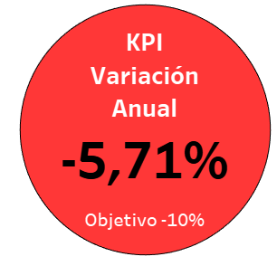

# Proyecto Análisis de Datos - Accidentes Viales CABA

Este proyecto consiste en realizar un Análisis de Datos sobre accidentes viales en la Ciudad Autónoma de Buenos Aires, y una presentación de los insights encontrados.
Los datos, disponibles desde el siguiente enlace: [Accidentes Buenos Aires](https://data.buenosaires.gob.ar/dataset/victimas-siniestros-viales), se tratan de dos archivos en formato Excel con dos hojas de datos en cada uno. El primero de ellos abarca los muertos en 616 accidentes viales entre 2016 y 2021, y el segundo abarca los lesionados en 23.785 accidentes, entre 2019 y 2021.  

Se muestra a continuación el mapa de accidentes de CABA donde cada punto es un registro de accidente del dataset.

## Análisis Exploratorio de Datos

El análisis exploratorio de datos está dividido en dos etapas diferentes y complementarias.  
La primera es la etapa de transformaciones ([Enlace al Cuaderno](EDA/2_EDA_transformaciones.ipynb)), donde se revisan los valores nulos y faltantes, se normalizan las fechas, se transforman a enteros las variables numéricas. Se eligen y transcriben a columnas finales, los datos de ubicación y los datos sobre vehículos participantes en los accidentes, y que se encuentran divididos entre varias columnas distintas. En conclusión, se prepara el dataset para poder realizar el análisis en conjunto del mismo.  
La segunda etapa del EDA es la del análisis propiamente dicho ([Enlace al Cuaderno](EDA/3_EDA_analisis.ipynb)). Se comienza estudiando que es lo que puede aportarnos cada una de las variables en forma individual, para luego pasar a combinarlas y buscar insights que nos lleven a identificar los puntos claves de la problemática de los siniestros viales.

### Resultado del EDA

Se presentan a modo de resumen introductorio los insights detectados a partir del análisis exploratorio de los datos. En el cuaderno del análisis se puede ver la información completa.

- El momento del día en el que ocurren más accidentes va desde las 12:00 a las 18:00, con un pico entre las 16:00 y las 17:00, que coincide con el fin de la jornada laboral de muchos gremios.  

- El grupo poblacional más afectado en los accidentes está compuesto principalmente por hombres (70% hombres / 30% mujeres) y en el rango etario de 20 a 40 años. Esto podría deberse a que esta población coincida con el grupo mayoritario de conductores. 

  

- **El vehículo que genera más lesionados en los accidentes son las motos,** y en su mayoría conducidas por hombres.

- Las avenidas en general, incluyendo a la General Paz, son las vías de circulación que reportan un mayor número (en cantidad y en porcentaje), de muertos y heridos graves en sus accidentes. Si consideramos que la longitud de las avenidas es aproximadamente un 25% de la longitud de calles, estos datos cobran mayor importancia. 
Los datos indicadores de cantidad de accidentes por unidad de longitud son los siguientes:  
General Paz 31.04 Accidentes/km  
Avenidas varias 14.40 Accicentes/km  
Calles 2.74 Accidentes/km  

- Se observa un pico de accidentes en la zona del "microcentro porteño", comunas 1, 3 y 4, entre las 9 y las 17. Franja horaria que como se expresó más arriba, coincide con la jornada laboral de muchos gremios.  

- Un observación particularmente alarmante, y que no está en relación con los demás puntos, es la cantidad de heridos graves y fallecidos que hay en el rol de peatones, casi un 70% u 80% comparando con los fallecidos en accidentes de motos o autos. Lógicamente la mayoría de los casos ocurre en la zona del microcentro, donde hay mayor cantidad de peatones. Este tipo de accidente constituye la causa principal de los fallecidos en la gente de mayor edad.  
Se muestra a continuación la cantidad de peatones fallecidos o con lesiones graves por comuna.

## Dashboard

La presentación se desarrolló con el software [Tableau](https://www.tableau.com/), haciendo uno de su funcionalidad "storytelling", y se disponibilizó en el servidor público. [**Enlace a la presentación.**](https://public.tableau.com/app/profile/marcelo.trinkard/viz/presentacion_17131977455650/Presentacion).  
La presentación cuenta con tres dashboards interactivos y consecutivos. El primero de ellos hace una puesta en contexto general de los datos, el segundo cala un poco más profundo analizando las muertes en accidentes de tránsito, mostrando además uno de los KPI propuestos, y en el último dashboard, se presentan los dos KPI específicos, abarcando dos de las víctimas más expuestas según los datos analizados, las motos y los peatones.  

### KPIs

Los tres KPI mostrados son:

- *Reducir en un 10% la tasa de homicidios en siniestros viales de los últimos seis meses, en CABA, en comparación con la tasa de homicidios en siniestros viales del semestre anterior*.
- *Reducir en un 7% la cantidad de accidentes mortales de motociclistas en el último año, en CABA, respecto al año anterior*.
- *Reducir en un 10% la cantidad de accidentes mortales de peatones en el último año, en CABA, respecto al año anterior*.

Se muestra a continuación, la presentación gráfica de los tres KPI mencionados:

  

## CONCLUSIONES

El presente estudio o análisis es impulsado por tres preguntas fundamentales: ¿QUÉ? ¿DONDE? ¿QUIÉN?. 

- ¿**Qué** está pasando? es la pregunta cuya respuesta da origen al análisis, los altos índices de mortalidad en accidentes de tránsito y la cantidad de accidentes con víctimas graves, ambos en el ámbito de la Ciudad Autónoma de Buenos Aires.  
- ¿**Donde** está pasando?. Es la primera de las dos preguntas que se busca responder. Los sectores con mayor cantidad de accidentes son la zona del microcentro porteño, comunas 1, 3 y 4. Y la zona centro norte de CABA, principalmente comuna 15. Si queremos ser más específicos, hay que poner el foco de atención en las avenidas de la ciudad, ya que aún con una extensión mucho menor a las calles, nuclean la mayor parte de los accidentes, y sobre todo los de mayor gravedad.
- ¿**Quién** está teniendo accidentes graves?. Para responder esta pregunta, surgen del análisis dos actores principales: Las motos y los peatones. Las motos son las víctimas de la mayor parte de los accidentes, y están conducidas en su mayoría por varones en el rango etario que va desde los 20 a los 40 años. En el caso de los peatones atropellados, el rango etario se extiende hacia los años de la vejez, siendo el grupo mayoritario el que abarca personas desde 70 años en adelante. Nuevamente son las avenidas el problema principal para ambas categorías.  

--------------------------------------------------

#### STACK TECNOLÓGICO

#### CONTACTO
Marcelo Trinkard  
(AR)+543492419953  
[LINKEDIN](https://www.linkedin.com/in/marcelo-trinkard-7b66a3295/)